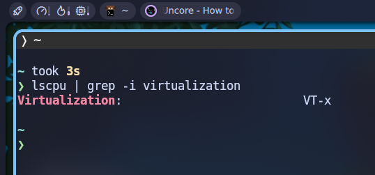
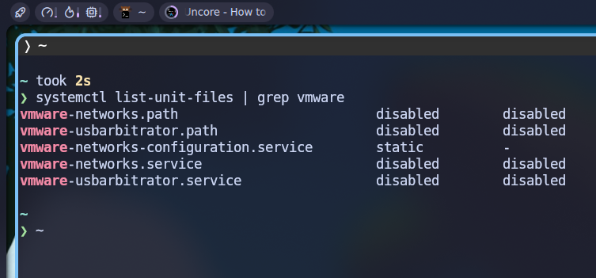
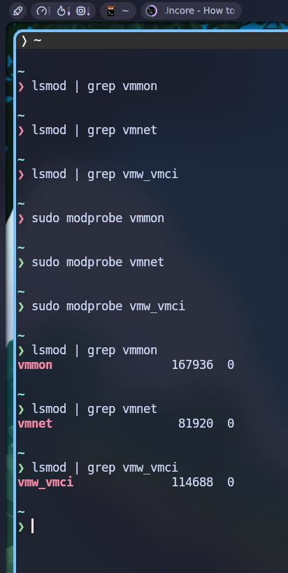

## Preface

VMWare perlu di-_install_ secara benar agar nanti _virtual machine_ yang berjalan di atasnya tidak mendapatkan kendala yang berarti. Tutorial ini dibuat sebagai referensi (pribadi) mengenai cara instalasi VMWare di linux (archlinux).

### About VMWare

[VMWare, Inc](https://www.vmware.com/) adalah sebuah perusahaan perangkat lunak virtualisasi yang berada di Amerika Serikat, tepatnya di Palo Alto, California. Sejak berdirinya pada tahun 1998, VMWare menjadi salah satu hypervisor virtualisasi paling terkenal di dunia, tentu saja selain [VirtualBox](https://www.virtualbox.org/) dan [Virt-Manager](https://virt-manager.org/).[^1] Pertahun 2022, VMWare diakuisisi oleh Broadcom.[^2] Salah satu produk VMWare yang akan saya bahas pada artikel ini adalah VMWare Workstation Pro, yang mana adalah sebuah software hypervisor untuk membuat mesin virtual yang gratis.

:::note

Kenapa saya catat instalasi VMWare di blog ini?
1. Karena VMWare bukan aplikasi atau _software_ _native_ linux, sehingga instalasinya tidak semudah meng-_install_ Virtualbox misalnya. 
2. File binary VMWare juga tidak ada di repo Archlinux (setidakya per artikel ini ditulis). Oleh sebab itu, instalasinya tidak straightforward dan sedikit kompleks (menurut saya) sehingga memerlukan catatan.  

:::

## Prerequisites

Beberapa hal yang perlu dipastikan sebelum meng-_install_ VMWare:

### Virtualization CPU

Pastikan CPU kita mendukung virtualisasi:

```shell
lscpu | grep -i virtualization
```

Jika ada _output_ seperti ini:



Maka kita dapat melanjutkan ke tahap berikutnya (instalasi). Namun, jika _output_ tidak menunjukkan hasil apapun, kemungkinan besar CPU kita memang tidak mendukung virtualisasi.

### `linux-headers`

Pastikan kita juga sudah meng-_install_ paket yang diperlukan oleh VMWare, yaitu `linux-headers`.

Untuk mengecek apakah kita sudah memiliki paketnya atau belum:

```shell
pacman -Qs | grep linux-headers
```

Jika tidak muncul _output_ apapun, artinya paket tersebut belum ter-_install_. Untuk memasang, gunakan perintah:

```shell
sudo pacman -Sy --needed linux-headers
```

### AUR PacMan (`yay`)

VMWare akan saya _install _dari AUR (_Arch User Repository_). Oleh karena itu AUR _package manager_ diperlukan. Saya akan menggunakan `yay`. Silakan cek, apakah `yay` sudah ter-_install_ atau belum dengan perintah: 

```shell
yay --version
```

Jika belum, sila _install_ terlebih dahulu:

```shell
sudo pacman -S --needed base-devel git && git clone https://aur.archlinux.org/yay.git && cd yay && makepkg -si
```

## Installation

Ada 2 cara insalasi VMWare di Archlinux:
1. via AUR (_Arch User Repository_)
2. via Broadcom Website

Saya hanya akan membahas cara instalasi via AUR.

### via AUR 

Cari VMWare di AUR dengan perintah:

```shell
yay -Ss vmware-workstation
```

Instal VMWare dengan perintah:

```shell
yay -Sy vmware-workstation
```

> **Notes:** Akan muncul beberapa prompt, tekan [Enter] saja ke setiap prompt yang muncul untuk melanjutkan proses instalasi dengan setelan default.

Tunggu beberapa saat karena ukuran file binary-nya cukup besar (300-an MB), dan proses _compile_-nya juga perlu waktu.

## Post-Installation

Beberapa hal yang perlu dilakukan sebelum menjalankan VMWare:

### VMWare Services

Setelah proses instalasi selesai, kita bisa melihat status beberapa _services_ milik VMWare yang di-_handle_ oleh **systemd** dengan perintah:

```shell
systemctl list-unit-files | grep vmware
```

Perintah tersebut akan menghasilkan beberapa _output_ _service_ yang masih dalam keadaan "**disabled**":



Minimal, kita perlu mengaktifkan `vmware-networks.service` agar _virtual machine_ kita nanti bisa mendapat akses internet. Tapi, untuk tutorial ini, saya juga akan mengaktifkan `vmware-usbarbitrator.service` agar memudahkan saya nanti jika _virtual machine_ dari VMWare ingin mengakses USB yang terpasang pada komputer fisik saya.[^3]

```shell
sudo systemctl start vmware-networks.service
sudo systemctl start vmware-usbarbitrator.service
```

:::info

Atau kalau ingin kedua _services_ tersebut juga langsung jalan begitu komputer dinyalakan:

```shell
sudo systemctl enable --now vmware-networks.service
sudo systemctl enable --now vmware-usbarbitrator.service
```

:::

### Kernel Module Load

Kita juga memerlukan beberapa kernel module:
1. `vmmon` (**_Virtual Machine Monitor_**): driver utama untuk menjalankan VMWare Workstation.
2. `vmnet` (**_Virtual Machine Networks_**): membuat dan mengatur interface jaringan virtual (seperti bridged, NAT, dan host-only).
3. `vmw_vmci` (**_VMWare's Virtual Machine Communication Interface_**): mengaktifkan kecepatan dan komunikasi langsung antara VM, host, dan hypervisor.

Untuk me-_load_ ketiga kernel module tersebut:

```shell
sudo modprobe vmmon
sudo modprobe vmnet
sudo modprobe vmw_vmci
```

Untuk memastikan ketiganya sudah berhasil ter-_load_:

```shell
lsmod | grep vmmon
lsmod | grep vmnet
lsmod | grep vmw_vmci
```



### Run VMWare

Sampai sini, kita sudah selesai melakukan instalasi VMWare.  
Sekarang, VMWare harusnya sudah dapat dijalankan dengan perintah `vmware` di terminal atau melalui app launcher favorit kalian.

:::info

Artikel advanced mengenai instalasi VMWare di Archlinux dapat dibaca di wiki berikut: https://wiki.archlinux.org/title/VMware

:::

Sekian.  
Terima kasih sudah membaca.  
Sampai jumpa lagi di artikel saya yang lain!

---

Mayoritas artikel ini disusun dengan merujuk pada video Youtube berikut:

<iframe width="100%" height="468"
  src="https://www.youtube.com/embed/2u2HoIhlZQ0"
  title="VMWare installation on Archlinux"
  frameborder="0" allowfullscreen>
</iframe>


[^1]: https://id.wikipedia.org/wiki/VMware
[^2]: https://en.wikipedia.org/wiki/VMware
[^3]: https://wiki.archlinux.org/title/VMware


