## Sekapur Sirih

Kemarin, saya mau bernostalgia dengan Windows Vista. Jadi, saya putuskan untuk menggunakan `docker compose` untuk men-_download_ Windows Vista tersebut (lihat di bawah untuk mengintai file konfigurasinya). Tetapi, masalah datang, saya tidak benar-benar mendapatkan fitur penuh Windows Vista dari docker tersebut. Misalnya, saya tidak bisa mengakses fitur **Windows Sidebar** (atau di beberapa versi Windows lain -Windows 7- disebut Windows Widget). Error yang muncul adalah "**_Windows sidebar is managed by your system administrator_**". Setelah diskusi di discord komunitas (Bob Pony) dan berkonsultasi ke AI (Antrophic Claude), akhirnya, saya memutuskan menyerah dan mencoba mencari alternatif lain (karena dugaan saya, komunitas, dan AI, itu disebabkan konfigurasi Windows Vista dari provider .iso tersebut memang di-desain untuk optimal dan cepat, bukan lengkap).

File konfigurasi `docker compose` saya:

```yml title="docker-compose.yml"
services:
  windows:
    image: dockurr/windows
    container_name: windows-vista
    environment:
      VERSION: "vu"
      USERNAME: "winvista"
      PASSWORD: "winvista123"
    devices:
      - /dev/kvm
      - /dev/net/tun
    cap_add:
      - NET_ADMIN
    ports:
      - 8006:8006
      - 3389:3389/tcp
      - 3389:3389/udp
    volumes:
      - ./windowsVista:/storage
      - ./sharingDirVis:/shared
    restart: no
    stop_grace_period: 2m
```

Btw, saya juga nulis dikit-dikit soal docker lho!

[[/tech/docker/]]

Jadi, apa alternatifnya?  
Saya memutuskan untuk mencari sendiri file ISO Windows Vista dan meng-_install_-nya nanti langsung sebagai _Virtual Machine_ menggunakan `virt-manager`.

Nah, tantangannya sekarang adalah tidak mudah menemukan file ISO Windows Vista (yang mana sudah lawas) yang official (atau sebut saja bersih/tidak disusupi malware atau semacamnya). Sebab, normalnya, kalau kita ingin mengunduh file ISO Windows terkini (Windows 11/Windows 10), kita bisa mengunjungi website Microsoft, karena memang mereka menyediakannya:

Website Microsoft untuk _download_ ISO Windows 10:[^1]  
https://www.microsoft.com/en-us/software-download/windows10ISO

Website Microsoft untuk _download_ ISO Windows 11:[^2]  
https://www.microsoft.com/en-us/software-download/windows11

Namun, seperti saya bilang tadi, Microsoft tidak lagi menyediakan file ISO Windows-Windows lawas seperti Windows 8, Windows 7, Windows Vista, dan Windows-Windows sebelumnya. Tentu sangat logis, mengingat merekalah yang nanti akan bertanggung jawab jika ada insiden _hacking_ ke _software-software_ lawas (yang pasti sudah tidak di-_support_ lagi _update_ dan _patch_-nya) yang digunakan oleh pelanggan / penggunanya. Maka, (sangat) masuk akal jika mereka men-_stop_ distribusi ISO Windows lama.

Tapi, buat orang seperti saya (yang pengen nostalgia), tentu ini sangat merepotkan. Hehe.

Jadi, (lagi-lagi, setelah bertanya ke komunitas) saya akhirnya bisa menemukan cara "ilmiah" untuk mendapatkan ISO Windows-Windows lawas itu, termasuk Windows yang sedang saya cari: **Windows Vista**.

## The (Official) Places?

Saya gak mau sebut website-website tempat saya mengunduh file ISO Windows ini sebagai "official", maka saya harus meletakkan kata "official" itu di dalam tanda kurung. Sebab, saya gak bisa pastikan bahwa website-website penyedia ISO Windows ini memang mengambil ISO tersebut dari Microsoft. Meskipun demikian, ada cara untuk kita memverifikasi integritas file ISO tersebut yang nanti akan saya jelaskan. 

Berikut adalah website-website yang dapat digunakan untuk mengunduh file ISO Windows:

### 1. Bob Pony

https://bobpony.com/downloads/

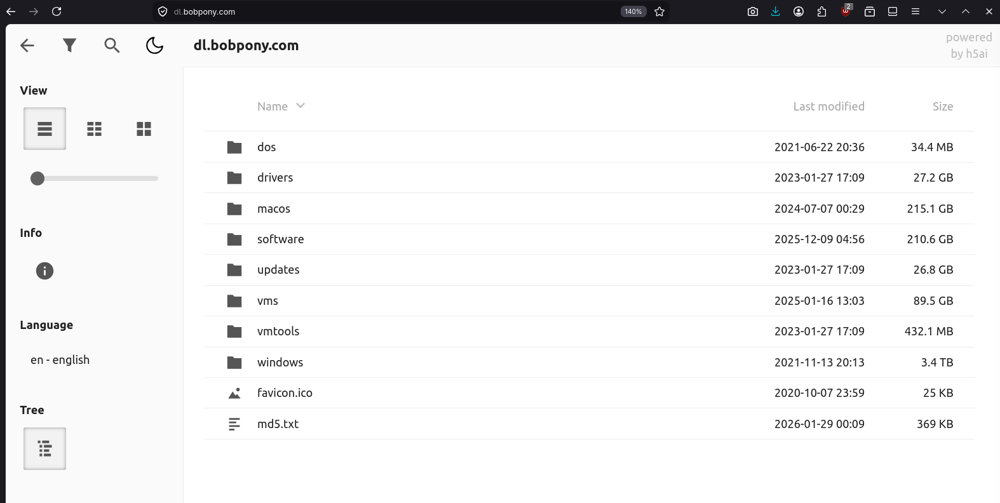

Ini adalah website yang digunakan oleh [Dockurr dari Docker](https://hub.docker.com/r/dockurr/windows) untuk men-_download_ file-file ISO Windows-nya.[^3] 

### 2. Massgrave

https://massgrave.dev/genuine-installation-media

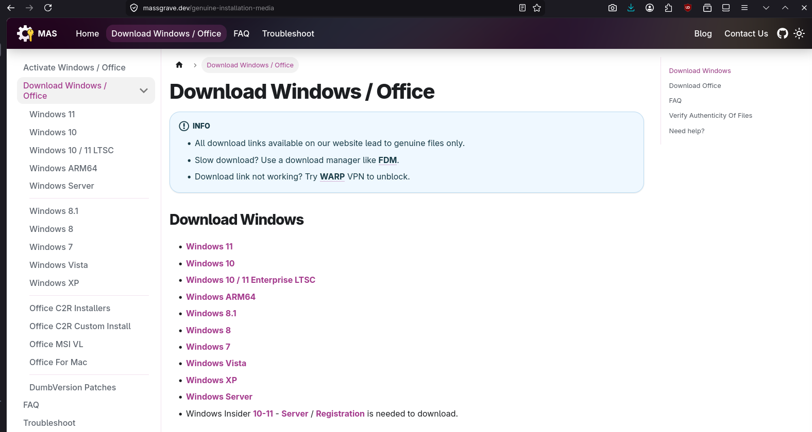

Ini adalah website yang pernah saya gunakan untuk mengaktivasi Windows (dan Office) karena memang website ini menurut saya adalah pakar di bidang "aktiviasi" Windows & Office. Tapi, selain itu, website ini juga (ternyata) menyediakan file ISO Windows.[^4]

Saya juga pernah bahas cara aktivasi Windows dengan script dari Massgrave ini:  

[[/tech/mas/]]

Kalian bisa baca-baca artikel di atas, terutama jika tertarik untuk tau cara mengaktivasi Windows dan status legalitas script ini.

:::info[Bahan Renungan]

Apakah orang dibalik kedua website tersebut (**Bob Pony** & **Massgrave**) adalah orang yang sama? Saya tidak tahu, tidak cari tahu juga, dan (rasanya) gak perlu tahu. Kalau kalian ingin tahu, silakan cari tahu sendiri, hehe.

:::

## Cara Verifikasi

Nah, cara verifikasinya mudah. Seperti kita tahu bersama, cara memverifikasi keaslian (atau integritas, bahasa komunitasnya) suatu file, kita bisa melihat dan membandingkan hash value dari filenya (**_checksum_**).

> Dalam cyber security, integritas (integrity) adalah salah satu dari triad-CIA (Confidentiality, Integrity, Availability), yang fungsinya adalah menjamin bahwa data tetap akurat, utuh, dan tidak diubah atau dirusak oleh pihak yang tidak bertanggung jawab.[^5]

Kita bisa melihat daftar hash value dari setiap iso file di website-website berikut:

### 1. Bob Pony

https://dl.bobpony.com/

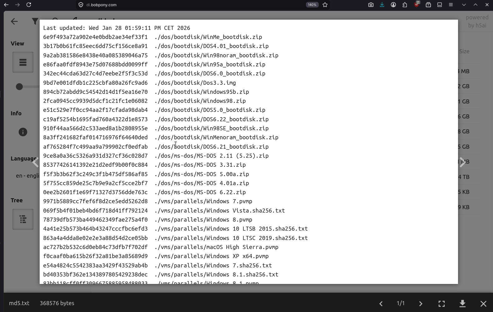

Seperti terlihat, di website tersebut, Bob Pony juga menyertakan sebuah file .txt yang berisi hash MD5 dari setiap file Windows iso yang dia punya di websitenya. Jadi, ketika kita selesai mengunduh sebuah iso file, kita bisa mengecek MD5 hash value dari website tersebut kemudian membandingkannya dengan MD5 hash yang ada di file .txt tersebut. Jika sama, berarti file ISO kita tidak rusak.[^6]

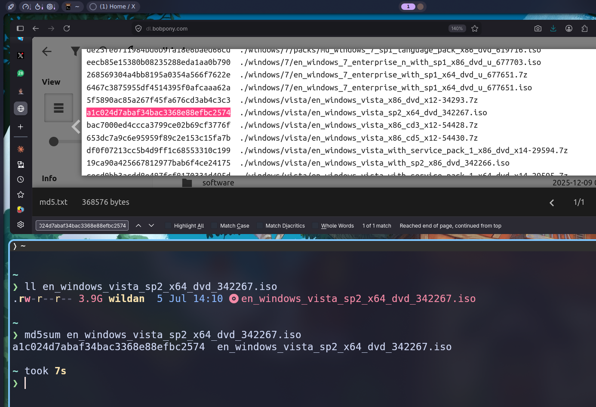

Seperti terlihat, saya bandingkan hash value dari file ISO Windows Vista saya dengan hash MD5 yang ada di website Bob Pony, hasilnya, MD5 hash value-nya **sama**. Website ini hanya menyediakan 1 jenis hash saja: MD5.

### 2. Rgadguard

Ada 3 sub-domain di website ini yang menyediakan database hash file ISO Windows:

#### A. files.rg-adguard.net

https://files.rg-adguard.net/search

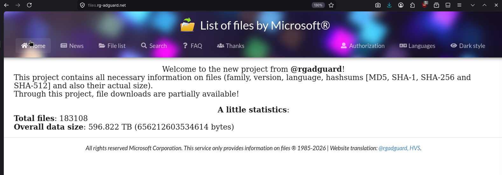

Menurut website Massgrave, website **rgadguard** yang ini adalah website yang menyediakan koleksi hash file ISO Windows paling lengkap.[^7] Di website ini, kita bisa melakukan _checksum_ menggunakan 4 jenis hash: MD5, SHA-1, SHA-256, dan SHA-512.[^8]

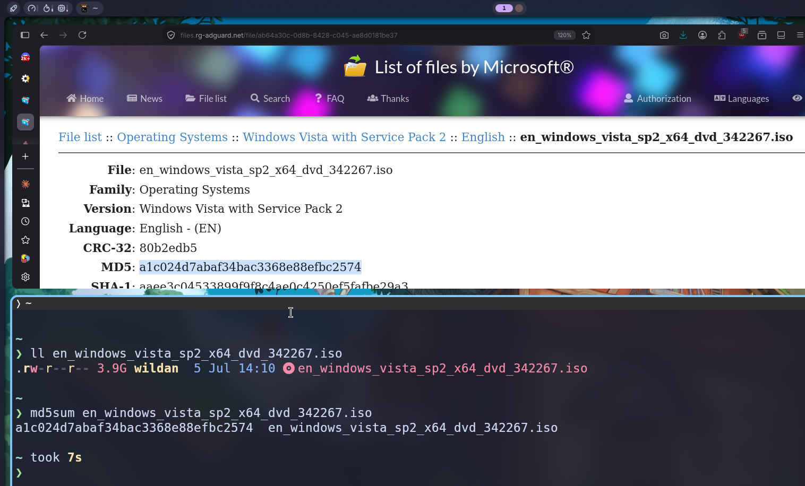

Seperti terlihat, saya bandingkan hash value dari file ISO Windows Vista saya dengan hash MD5 yang ada di website rgadguard, hasilnya, MD5 hash value-nya **sama**.

#### B. msdn.rg-adguard.net

https://msdn.rg-adguard.net/

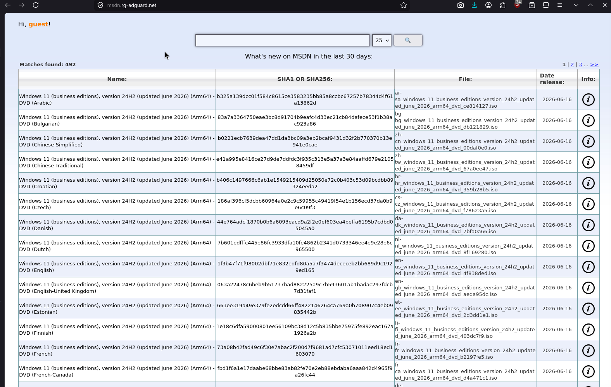

Ini adalah sub-domain dari website yang sama (rgadguard). Kita juga dapat mencari hash value dari file ISO Windows kita di sini. Tapi, di sini kita hanya disediakan 2 jenis hash saja: SHA1 dan SHA256.[^9]

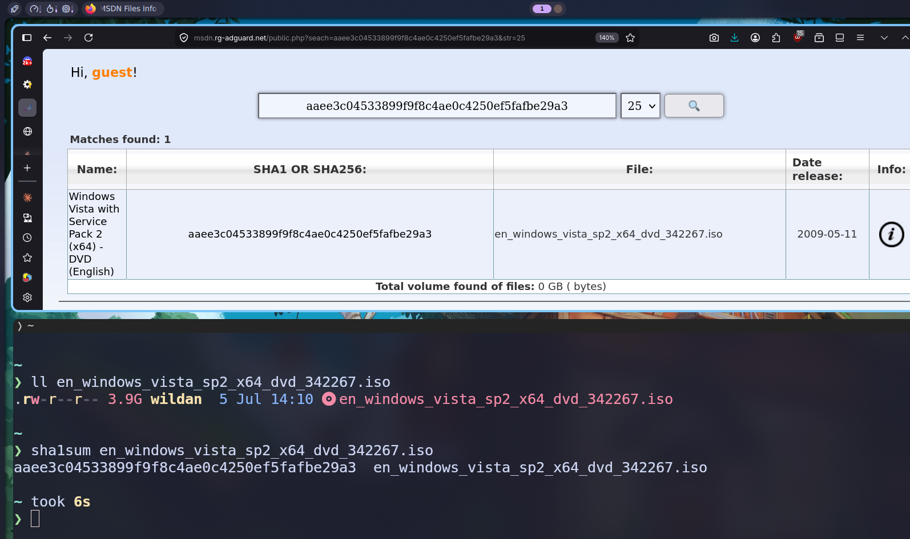

Seperti terlihat, saya bandingkan hash value dari file ISO Windows Vista saya dengan hash SHA1 yang ada di website rgadguard, hasilnya, SHA1 hash value-nya **sama**.

#### C. sha1.rg-adguard.net

https://sha1.rg-adguard.net/

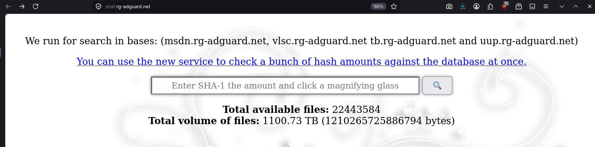

Ini juga adalah sub-domain dari website yang sama (rgadguard). Meskipun kita juga dapat mencari hash value dari file ISO Windows kita di sini, tapi jenis hash yang disediakan hanya 1, yaitu SHA1.[^10]

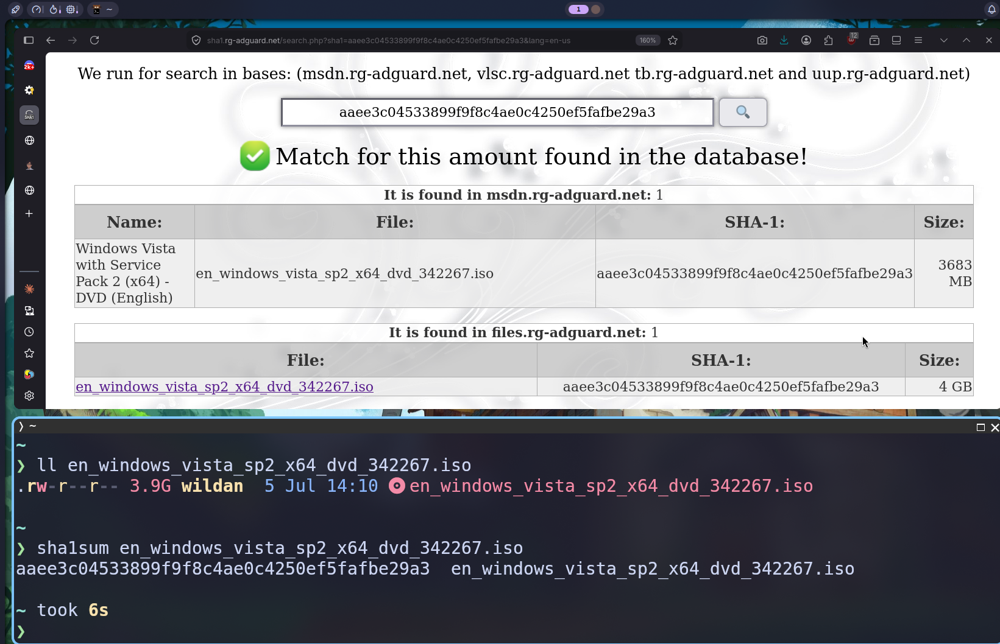

Seperti terlihat, saya bandingkan hash value dari file ISO Windows Vista saya dengan hash SHA1 yang ada di website rgadguard, hasilnya, SHA1 hash value-nya **sama**.

### 3. MVS Dump

https://awuctl.github.io/mvs/

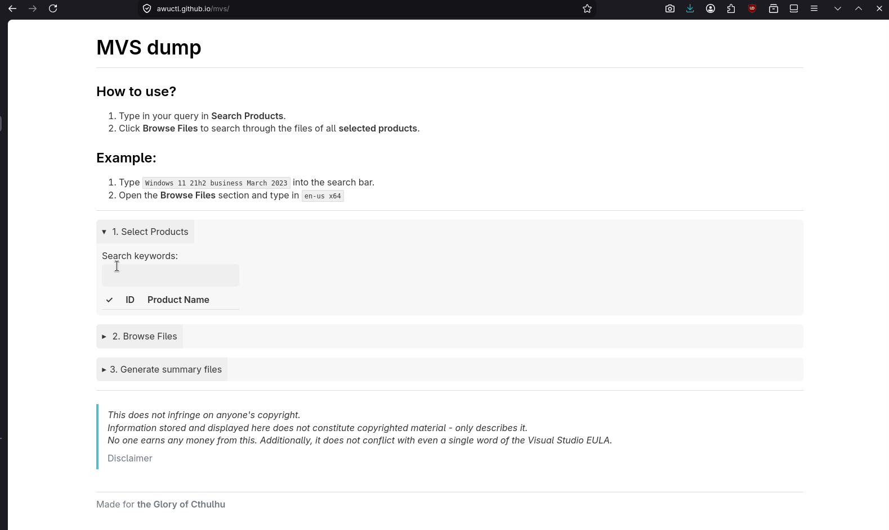

Ini adalah alternatif website yang juga dapat digunakan untuk melakukan verifikasi integritas file (**_checksum_**). Kita hanya bisa menggunakan 2 jenis hash di sini: SHA-1 dan SHA-256.[^11]

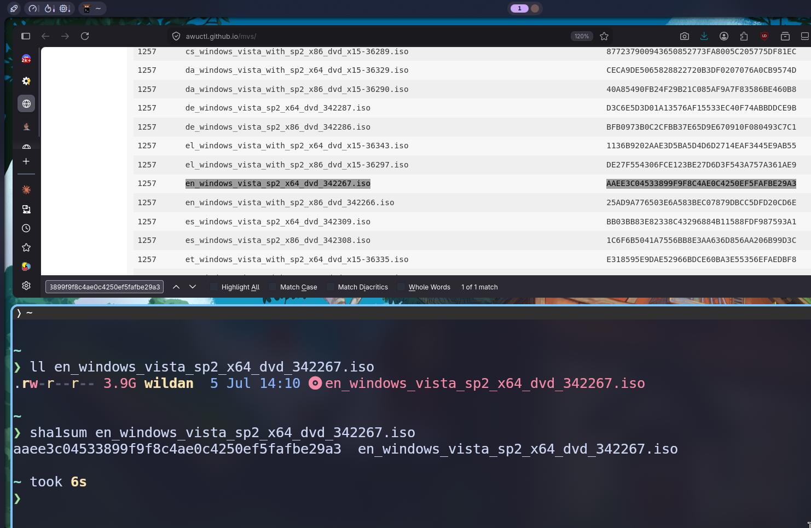

Seperti terlihat, saya bandingkan hash value dari file ISO Windows Vista saya dengan hash SHA1 yang ada di website MVS Dump, hasilnya, SHA1 hash value-nya **sama**.

### Google & AI

Selain itu, kita juga bisa memverifikasi hash value dari file ISO Windows kita dengan men-googling-nya saja di internet atau bertanya melalui AI seperti ChatGPT, Gemini, Claude, Meta, dan lain sebagainya. 

Intinya, cara memverifikasi hash suatu file hanya 2:
1. Lihat hash value dari file ISO Windows.
2. Bandingkan dengan database hash value file ISO Windows terkait (bisa di website-website yang sudah saya berikan atau di Google dan tanya di AI).

Sekian.  
Terima kasih sudah membaca.  
Sampai berjumpa lagi di artikel-artikel saya yang lain!


[^1]: https://www.microsoft.com/en-us/software-download/windows10ISO
[^2]: https://www.microsoft.com/en-us/software-download/windows11
[^3]: https://bobpony.com/downloads/
[^4]: https://massgrave.dev/genuine-installation-media
[^5]: https://www.cyberacademy.id/blog/cia-triad-fondasi-utama-information-security-yang-wajib-dipahami-pemula
[^6]: https://dl.bobpony.com/
[^7]: https://massgrave.dev/genuine-installation-media#verify-authenticity-of-files
[^8]: https://files.rg-adguard.net/search
[^9]: https://msdn.rg-adguard.net/
[^10]: https://sha1.rg-adguard.net/
[^11]: https://awuctl.github.io/mvs/