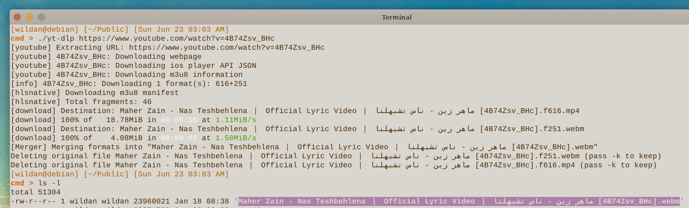
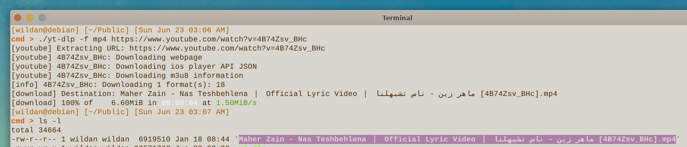
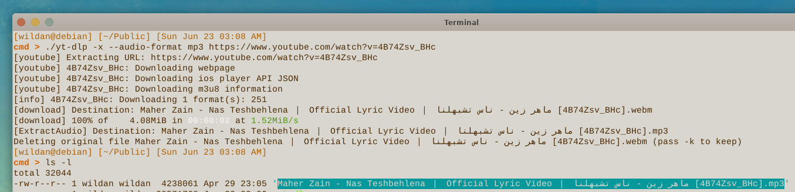
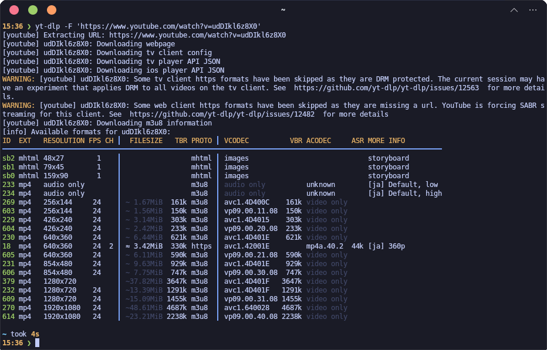
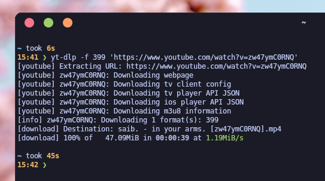

# What Is It?

***Apa yang akan kalian lakukan kalau mau mengunduh video Youtube?***  
A. Mengunjungi website seperti savefrom, savetube, y2meta, ssyoutube, dll.  
B. Mengunduh aplikasi seperti MediaHuman, Open Video Downloader, dll.  
C. Memutar videonya via VLC Player.  
D. Mengunduh langsung di aplikasi Youtube.  

***Bisakah kalian menentukan format videonya juga?***  
***Bagaimana kalau kalian hanya ingin mengunduh audionya saja?***  
***Bagaimana jika videonya ada di platform selain Youtube?***

Perkenalkan, **`yt-dlp`** adalah sebuah program berbasis *open source* yang kurang lebih fungsinya adalah untuk menjawab pertanyaan-pertanyaan serupa seperti yang ada di atas sebelumnya. Seperti yang tertera pada judul, **`yt-dlp`** adalah program berbasis *command line* yang kaya akan fitur-fiturnya untuk mengunduh audio dan juga video. Perlu diketahui juga bahwa **`yt-dlp`** merupakan *project* fork dari program *project* / program aslinya (yang juga *open source* dan berbasis cli), yaitu **`youtube-dl`**.      

> **Note:**  
> Berikut adalah tautan project **`ytd-dlp`** di github:  
> ::github{repo="yt-dlp/yt-dlp"}

Meskipun namanya **`yt-dlp`** (yang mana kita bisa duga, bagian "yt"-nya adalah akronim dari Youtube), tapi *tool* ini dapat digunakan juga untuk mengunduh audio/video dari platform lain, seperti BiliBili, IQIYI, Crunchyroll, Facebok, Instagram, Pinterest, Tiktok, Twitter, dan masih banyak lagi.

Selangkapnya, baca [di sini](https://github.com../images/yt-dlp/yt-dlp/blob/master/supportedsites.md)[^1].

# How to Install It?

Instalasinya cukup mudah karena **`yt-dlp`** *support* untuk sistem operasi yang desktop, seperti Windows, Mac, dan Linux tentu saja.

## Linux Installation

| No  |           Distro                                                                  |             Install              |
|----:|:----------------------------------------------------------------------------------|:--------------------------------:|
|  1  |   [**Debian**](https://packages.debian.org/bookworm/yt-dlp)                       |  `sudo apt install yt-dlp`       |
|  2  |   [**Arch**](https://archlinux.org/packages/extra/any/yt-dlp/)                    |  `sudo pacman -S yt-dlp`         |
|  3  |   [**OpenSuse**](https://software.opensuse.org/package/yt-dlp)                    |  `sudo zypper in yt-dlp`         |
|  4  |   [**Fedora**](https://packages.fedoraproject.org/pkgs/yt-dlp/yt-dlp/)            |  `sudo dnf install yt-dlp`       |

Atau kalau *package* **`yt-dlp`** dari repo distro-nya ***outdated*** alias belum *update* ke versi yang terbaru, kita bisa gunakan binary-nya yang juga disediakan di repo officialnya:

https://github.com/yt-dlp/yt-dlp/releases/latest/download/yt-dlp

## Windows Installation

Kita tidak perlu melakukan instalasi jika menggunakan Windows karena cukup mengunduh file binary-nya saja berikut ini:

https://github.com/yt-dlp/yt-dlp/releases/latest/download/yt-dlp.exe


## Mac Installation

Kita juga hanya perlu mengunduh file binary untuk Mac berikut:

https://github.com/yt-dlp/yt-dlp/releases/latest/download/yt-dlp_macos


# How to use it?

Cara menggunakannya tentu bergantung dengan kebutuhan yang diperlukan. Saya hanya akan membahas beberapa penggunaan sederhana yang sehari-hati biasa saya lakukan saja karena kalau saya membahas semuanya, tentu artikel ini menjadi sangat panjang dan tidak efektif. 

Jika kalian ingin mencari tahu lebih jauh tentang kegunaan tools ini, sila kunjungi repo github resminya yang sudah saya berikan di awal artikel.

## Mengunduh video Youtube

### Default

Kita bisa gunakan perintah
```shell
yt-dlp <link video youtube>
```
untuk mengunduh video dengan format default, yaitu `.webm`.



### Spesific Format

Kalau ingin spesifik dengan format tertentu, kita bisa tambahkan flag `-f` atau `--format` disertai dengan format yang diinginkan, misalnya `mp4`:
```shell
yt-dlp -f mp4 <link video youtube>
```



### Audio Only

Untuk mengekstrak audio-nya saja dari video, kita bisa gunakan flag `-x` untuk mengekstrak audio-nya dan menambahkan flag `audio-format` disertai format audio yang diinginkan, misalnya `mp3`:
```shell
yt-dlp -x --audio-format mp3 <link video youtube>
```



### See Available Size & Format

Untuk melihat ukuran dan format video yang tersedia:

```shell
yt-dlp -F <link video youtube>
```



### Spesific Size

Untuk mengunduh video dengan ukuran pixel tertentu:

```shell
yt-dlp -f <ID> <link video youtube>
```



Yaa, sekian dulu, hehe.  

> **Note:** Artikel ini akan saya perbarui.


[^1]: https://github.com../images/yt-dlp/yt-dlp